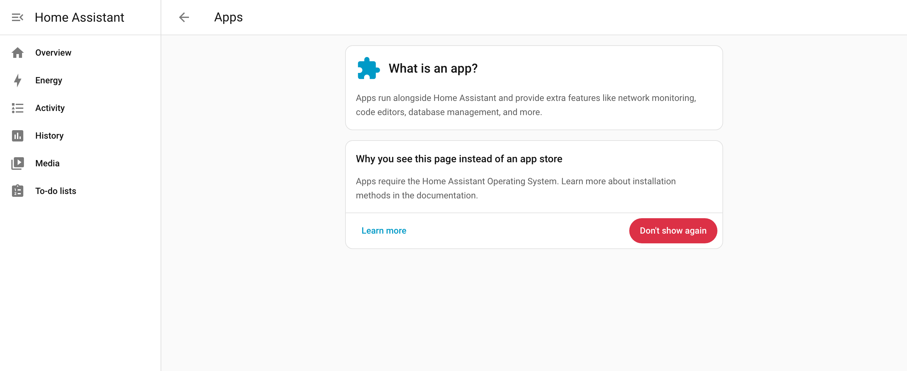
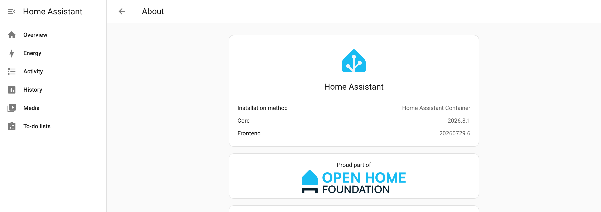

Ako ti već radi Linux server 24/7 — mini PC, stari laptop, NAS ili virtualka na Proxmox-u — nema mnogo smisla da kupuješ Raspberry Pi samo za Home Assistant. Docker kontejner je petnaest minuta posla i troši manje resursa nego što misliš.

Ali ova varijanta ima **jednu bitnu posledicu** koju treba da znaš pre nego što kreneš, jer se kasnije teško menja. Zato prvo o tome.

## Pročitaj ovo pre nego što kreneš

Home Assistant se instalira na tri načina koja su u praksi različita:

| | Šta dobijaš | Šta plaćaš |
|---|---|---|
| **HA OS** | ceo sistem, aplikacije na klik, ugrađeni backup | zauzima celu mašinu ili virtualku |
| **HA Container** (ovaj tekst) | ide pored ostalih servisa, štedi resurse | **nema aplikacija (Apps)** |
| **HA Supervised** | aplikacije + tvoj Linux | traži tačno određen sistem, lako se „raspadne" |

Ključna stavka je ta srednja. **U Docker varijanti ne postoji prodavnica aplikacija.** Ono što se u HA OS-u instalira jednim klikom — Mosquitto, Zigbee2MQTT, ESPHome, Node-RED — ovde moraš da pokreneš **kao zasebne kontejnere**, sam.

Mala zamka u imenima: ono što se godinama zvalo **add-ons** sada se u Home Assistant-u zove **Apps**. Stavka „Apps" postoji u Podešavanjima i u Docker instalaciji, pa na prvi pogled izgleda da sve imaš — ali kad je otvoriš, dobiješ objašnjenje umesto prodavnice:



Slika je iz Home Assistant-a **2026.8.1** koji radi kao običan Docker kontejner. Ako u starijim tekstovima na internetu vidiš „Add-ons", to je isto ovo, samo pod starim imenom.

Za koga je to u redu:

- ako ti je Docker već poznat i ionako držiš nekoliko kontejnera,
- ako ti server radi još nešto i ne želiš da ga daš celog Home Assistant-u,
- ako želiš da tačno znaš šta se pokreće na tvojoj mašini.

Za koga nije: ako ti je ovo prvi kontakt i sa Linux-om i sa Home Assistant-om, uzmi **HA OS u virtualki** i preskoči ovaj tekst. Nije ti manje vredan sistem — samo je manje posla. Za tu varijantu imamo [instalaciju za 30 minuta](/blog/instalacija-home-assistant-30-minuta/).

Dobra vest: **HACS radi normalno** u Docker varijanti. HACS nije aplikacija nego integracija, pa ti sve one integracije iz zajednice ostaju dostupne.

## Šta ti treba

- Linux server sa instaliranim **Docker-om** i **Docker Compose plugin-om** (`docker compose version` treba da nešto ispiše).
- Oko **2GB RAM-a** slobodno i nekoliko GB prostora. Home Assistant sam po sebi je skroman; baza podataka raste vremenom.
- **Žična mreža.** Ne zbog brzine, nego zato što otkrivanje uređaja radi preko multicast-a, a on preko wifi-ja često zapne.

⚠️ **Jedna stvar koju ne treba raditi:** `/config` folder ne stavljaj na mrežni disk (NFS, SMB, montiran NAS share). Home Assistant čuva istoriju u SQLite bazi, a SQLite preko mreže se **kvari** — ne odmah, nego za mesec-dva, kad ti je baza već puna podataka. Lokalni disk, bez izuzetka.

## Korak 1 — compose fajl

Napravi folder i u njemu `docker-compose.yml`:

```sh
mkdir -p ~/homeassistant && cd ~/homeassistant
```

```yaml
services:
  homeassistant:
    container_name: homeassistant
    image: ghcr.io/home-assistant/home-assistant:stable
    restart: unless-stopped
    network_mode: host
    environment:
      - TZ=Europe/Belgrade
    volumes:
      - ./config:/config
      - /etc/localtime:/etc/localtime:ro
      - /run/dbus:/run/dbus:ro
```

Četiri linije u tom fajlu su bitnije od ostalih:

**`network_mode: host`** — kontejner koristi mrežu servera direktno, bez svog izolovanog mrežnog prostora. Ovo **nije** kozmetika: bez toga Home Assistant ne vidi multicast, pa ti ne radi automatsko otkrivanje uređaja (Chromecast, Sonos, Shelly, HomeKit, ESPHome). Videćeš prazan spisak i mislićeš da uređaji nisu na mreži.

Zbog `host` režima **ne treba `ports:`** — 8123 je odmah dostupan na IP adresi servera.

**`./config:/config`** — ovo je ceo tvoj Home Assistant. Svaka automatizacija, svaki uređaj, cela istorija. Kontejner je zamenljiv, ovaj folder nije. Zapamti gde je.

**`image: …:stable`** — namerno `stable`, ne `latest`. Kod Home Assistant-a je `latest` nekad brže od tvoje volje.

**`/run/dbus`** — potrebno samo ako ćeš koristiti Bluetooth sa samog servera. Ako nećeš, izbaci tu liniju.

## Korak 2 — pokreni

```sh
docker compose up -d
```

Prvo pokretanje traje **par minuta** — Home Assistant pravi bazu i inicijalnu konfiguraciju. Ako odmah otvoriš adresu, videćeš belu stranicu ili grešku. To je normalno, ne diraj ništa.

Praćenje uživo:

```sh
docker compose logs -f
```

Kad u logu vidiš da je startovao, otvori u browseru:

```
http://IP-ADRESA-SERVERA:8123
```

Da proveriš da ti zaista radi ova varijanta, idi na **Settings → About**. Pod „Installation method" treba da piše `Home Assistant Container`:



Dalje je isto kao u svakoj instalaciji — napraviš nalog (**ovo je lokalni nalog na tvom serveru**, ne cloud registracija), uneseš lokaciju i jedinice mera. Lokacija je važnija nego što izgleda: od nje zavise izlazak i zalazak sunca, a to je okidač za veliki deo automatizacija.

## Korak 3 — Zigbee dongle

Ako imaš Zigbee koordinator, kontejneru treba dati pristup tom USB uređaju. Prvo nađi njegovu putanju:

```sh
ls -l /dev/serial/by-id/
```

Dobiješ nešto poput `usb-ITead_Sonoff_Zigbee-3.0_USB_Dongle_Plus_...-if00-port0`. Dodaj u compose:

```yaml
    devices:
      - /dev/serial/by-id/usb-ITead_Sonoff_Zigbee-3.0_USB_Dongle_Plus_xxxx-if00-port0:/dev/ttyUSB0
```

⚠️ **Koristi `by-id` putanju, nikako `/dev/ttyUSB0` direktno.** `ttyUSB0` je samo redni broj — ubodeš drugi USB uređaj ili restartuješ server i tvoj dongle postane `ttyUSB1`. Zigbee mreža „nestane" bez ijedne poruke o grešci, a ti tražiš grešku u Home Assistant-u dok problem uopšte nije tamo. `by-id` putanja je vezana za sam uređaj i ne menja se.

⚠️ **A ovo je zamka koja hvata i ljude sa iskustvom:** ako dongle izvučeš i vratiš, **`docker compose restart` ne pomaže.** Docker uređaj vezuje u trenutku *kreiranja* kontejnera, ne pokretanja. Posle ponovnog uključivanja donglea mora:

```sh
docker compose up -d --force-recreate
```

Zato zapiši i ovo: kad ti Zigbee prestane da radi „bez razloga", prvo proveri da li je nešto diralo USB.

## Korak 4 — Bluetooth (ako ti treba)

Za Bluetooth senzore i brave, uz `/run/dbus` iz compose fajla, kontejneru trebaju i veća prava:

```yaml
    privileged: true
```

Ako ti Bluetooth ne treba, nemoj ovo dodavati. `privileged: true` kontejneru daje skoro pun pristup serveru i nije nešto što se stavlja „za svaki slučaj".

## Korak 5 — ono što ćeš morati sam

Ovde se plaća cena Docker varijante. Najčešće ti trebaju dve stvari, i obe idu kao zasebni kontejneri u istom compose fajlu:

**MQTT broker** — potreban za Zigbee2MQTT, ESPHome uređaje i dobar deo ostalog:

```yaml
  mosquitto:
    container_name: mosquitto
    image: eclipse-mosquitto:2
    restart: unless-stopped
    network_mode: host
    volumes:
      - ./mosquitto/config:/mosquitto/config
      - ./mosquitto/data:/mosquitto/data
```

Mosquitto od verzije 2 **podrazumevano ne prima veze sa mreže** dok mu ne napišeš konfiguraciju — to je namerna bezbednosna promena i mesto gde svi zapnu prvi put. Treba mu `mosquitto.conf` sa `listener 1883` i podešenim nalogom.

**Zigbee2MQTT** — ako umesto ugrađenog ZHA ideš na njega. On tada, a ne Home Assistant, dobija dongle preko `devices:`. Ne mogu oba istovremeno da drže isti koordinator.

Ako ti sve ovo zvuči kao previše — to je legitiman odgovor i tačno je razlog zbog kog većina ljudi ostane na HA OS-u. Za prvih deset Zigbee uređaja ugrađeni **ZHA** je sasvim dovoljan i ne traži ni Mosquitto ni Zigbee2MQTT.

## Ažuriranje

```sh
docker compose pull && docker compose up -d
```

Dve navike koje se isplate:

1. **Ne ažuriraj isti dan kad izađe verzija.** Home Assistant izlazi prvog srede u mesecu i popravke stižu u prvih nedelju dana.
2. **Pročitaj „Backward-incompatible changes"** u objavi verzije. To je jedini deo koji zaista mora da se pročita — tamo piše šta će ti se pokvariti.

Stare slike koje se nakupe:

```sh
docker image prune
```

## Backup — ovo je na tebi

U HA OS-u backup je dugme. Ovde nije, i to je najveći rizik ove instalacije: sve radi mesecima, pa jednog dana disk stane.

Ceo tvoj sistem je onaj `config` folder. Najprostija verzija koja stvarno pomaže:

```sh
docker compose stop
tar czf ~/ha-backup-$(date +%F).tar.gz config
docker compose start
```

Zaustavljanje pre arhiviranja nije preterivanje — SQLite baza kopirana „u letu" ume da bude neupotrebljiva, a to otkriješ tek kad ti backup zatreba. Stavi ovo u `cron` jednom nedeljno i pošalji arhivu **sa tog servera negde drugde**. Backup koji stoji na istom disku kao original nije backup.

## Da li se može promeniti mišljenje kasnije

Može, i lakše je nego što izgleda. Prelazak sa Container na HA OS radi se preko backup-a: `config` folder nosi automatizacije, uređaje, dashboard-e i istoriju. Ono što ne prelazi su kontejneri koje si sam pokrenuo — Mosquitto i Zigbee2MQTT se tamo postavljaju iznova, ovog puta na klik.

Nije prijatno, ali nije ni gubitak posla. Nemoj zato mesecima da se lomiš oko izbora.

## Šta dalje

Kad ti Home Assistant radi, najbolje je da odmah napraviš nekoliko automatizacija — sistem koji ništa ne automatizuje se ne koristi i ugasi se za dve nedelje. Kreni od [prvih 5 automatizacija](/blog/prvih-5-automatizacija/), a ako još nemaš uređaje, tu je [spisak jeftinog Zigbee hardvera za početak](/blog/jeftini-zigbee-senzori-i-uticnice-za-pocetak/).
