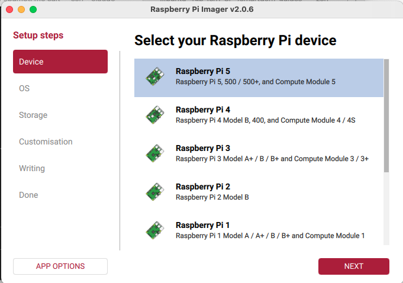
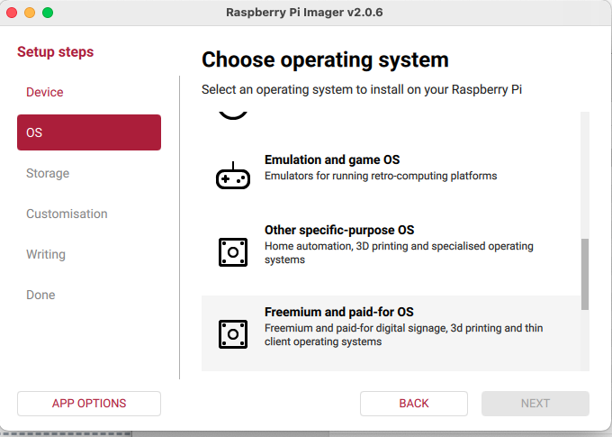
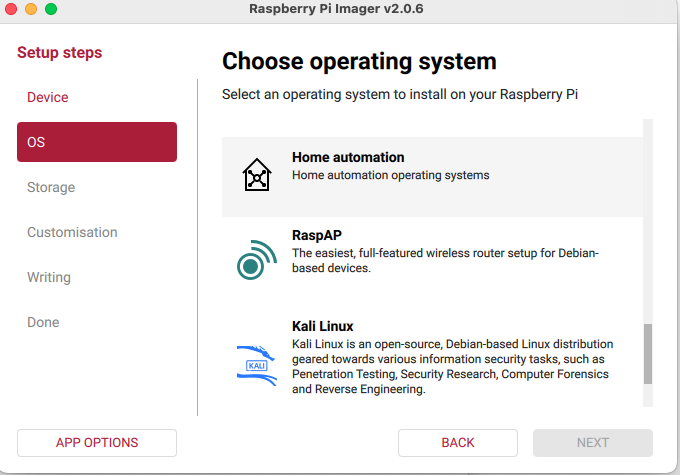
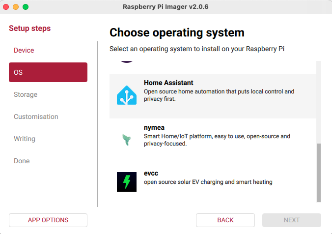
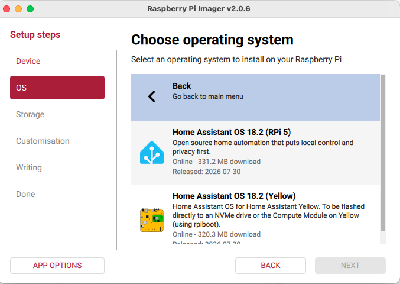
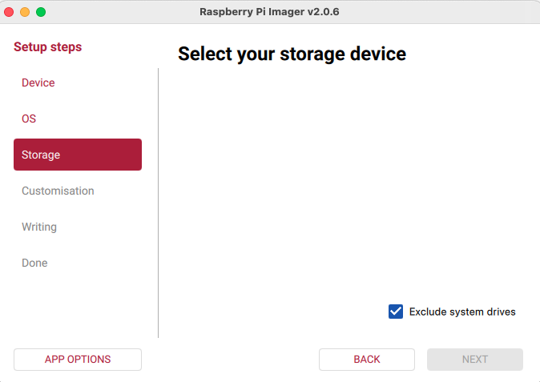
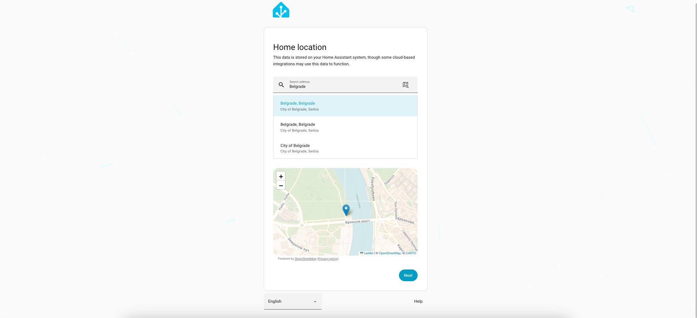
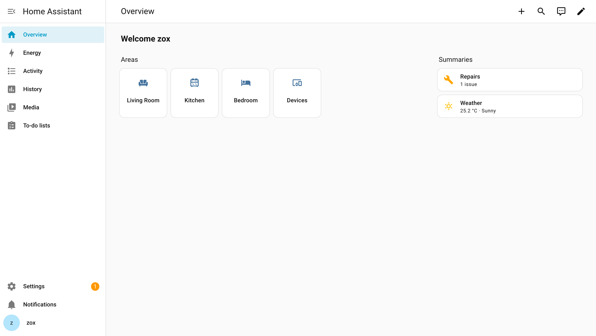
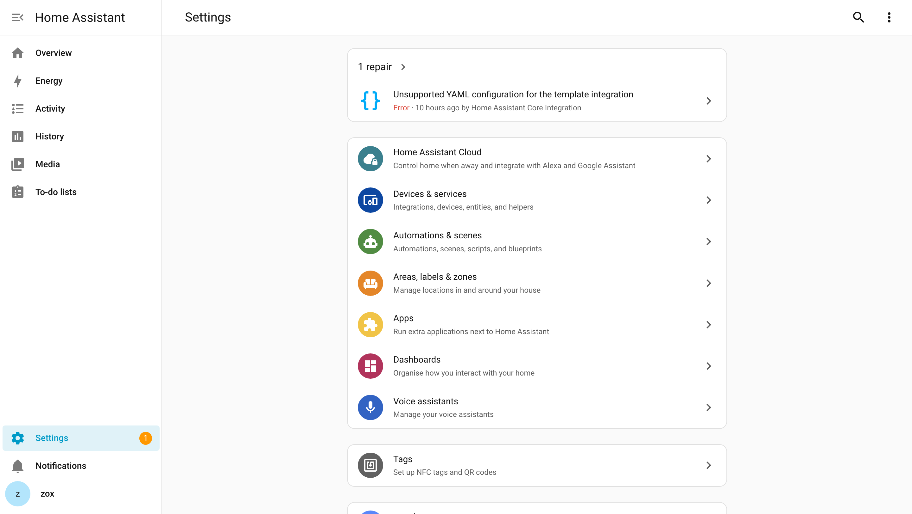
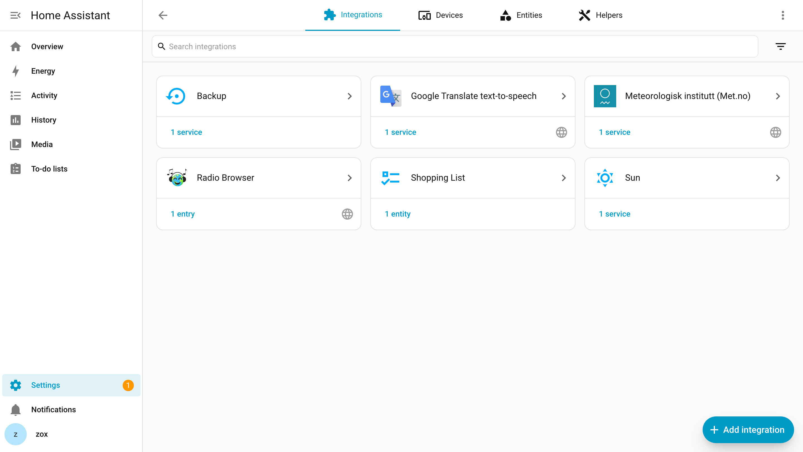

Ne treba ti Linux iskustvo ni programiranje da bi pokrenuo Home Assistant. Najlakši put je **Home Assistant OS** — gotov sistem koji se flash-uje na SD karticu ili SSD, kao instaliranje aplikacije na telefon.

## Šta ti treba

- **Raspberry Pi 4 ili 5** (4GB RAM je dovoljno; 5 je brži ako planiraš više uređaja i integracija) — ili bilo koji mini PC/stari laptop.
- **MicroSD kartica (min 32GB, klasa A2)** ili SSD preko USB-a (SSD je pouzdaniji na duge staze).
- **Kabl za struju i mrežni kabl** (žično je stabilnije od wifi-ja za server koji radi 24/7).
- Računar sa koga instaliraš — Windows, Mac ili Linux, svejedno.

## Korak 1 — Flash-uj Home Assistant OS

Skini i instaliraj **Raspberry Pi Imager** (zvanični alat, besplatan). Slike ispod su iz verzije 2.0.6 — u starijim verzijama je redosled malo drugačiji, ali su nazivi isti.

**1. Izaberi svoj model Raspberry Pi-ja.** Ovo je važno: verzija Home Assistant OS-a koja se nudi kasnije zavisi baš od ovog izbora.

**2. Pod „Choose OS" idi na dno liste, na „Other specific-purpose OS".** Home Assistant nije među ponuđenim sistemima na prvom ekranu — zakopan je dva nivoa niže, i to je mesto gde većina ljudi zapne.

**3. Zatim „Home automation".**

**4. Pa „Home Assistant".**

**5. I na kraju verzija za tvoj model** — na slici je „Home Assistant OS 18.2 (RPi 5)". Pazi da u zagradi piše tvoj model.

**6. Izaberi SD karticu ili SSD kao cilj**, pa klikni **Write**.

Ako je ova lista prazna kao na slici, kartica nije ubačena ili je čitač ne vidi. Kvačica **„Exclude system drives"** je tu da te zaštiti od toga da slučajno prepišeš sistemski disk — ostavi je uključenu.

⚠️ **Upis briše sve** što je prethodno bilo na kartici.

## Korak 2 — Prvo pokretanje

1. Ubaci SD karticu/SSD u Raspberry Pi, poveži mrežni kabl i struju.
2. Sačekaj 5-10 minuta — sistem se prvi put priprema, nemoj da ga isključuješ u međuvremenu.
3. Sa drugog računara na istoj mreži, otvori u browseru: `http://homeassistant.local:8123`
   - Ako to ne radi, proveri IP adresu Raspberry Pi-ja preko rutera i otvori `http://<ta-ip-adresa>:8123`

## Korak 3 — Kreiranje naloga

Otvoriće se čarobnjak za podešavanje:

1. Kreiraj korisničko ime i lozinku (ovo je tvoj glavni admin nalog).
2. Unesi lokaciju. Dovoljno je da ukucaš grad i izabereš iz ponuđenog — Home Assistant sam nađe koordinate i vremensku zonu.

   Ovo nije formalnost: od lokacije zavise izlazak i zalazak sunca (najčešći okidač u automatizacijama) i vremenska prognoza.
3. Home Assistant automatski skenira mrežu i predlaže uređaje koje je pronašao — možeš ih dodati odmah ili kasnije.

## Korak 4 — Šta sad?

Kad čarobnjak završi, dočeka te ovakav ekran. Prazan je — sobe su tu, ali u njima još nema nijednog uređaja:

Dole levo je **Settings**, odakle se podešava sve ostalo:

Uređaji se dodaju pod **Devices & Services**. Na svežoj instalaciji je i to prazno; dugme **Add integration** dole desno je mesto odakle kreće svaki nov uređaj:

Imaš radan sistem. Sledeći logičan korak je da dodaš prvi pravi uređaj (pametnu utičnicu ili Zigbee senzor) i napraviš prvu automatizaciju — to pokrivamo u sledećem vodiču.

**Napomena:** ako nemaš Raspberry Pi, Home Assistant možeš pokrenuti i u Docker kontejneru na bilo kom Linux serveru (npr. na istom onom na kom hostuješ ovaj sajt) — o tome pišemo posebno, jer instalacija tada ima par dodatnih koraka oko mrežnog podešavanja.
