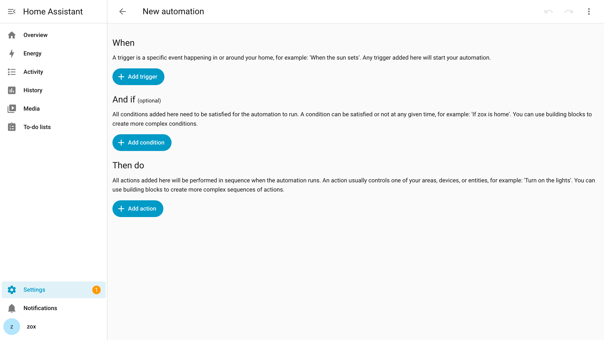
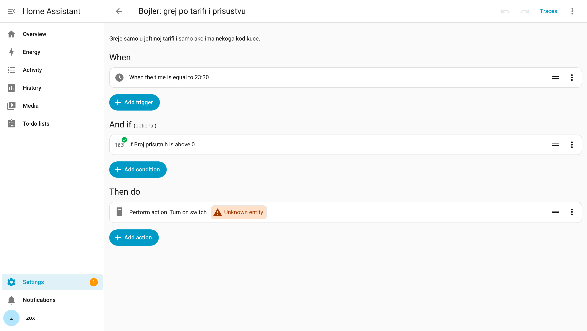
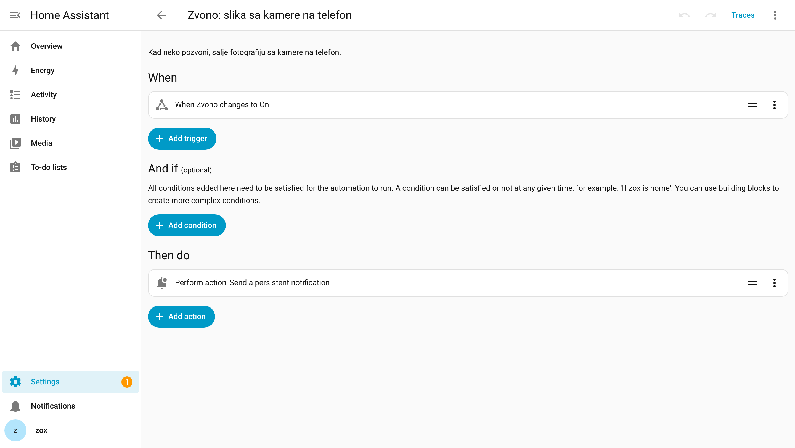
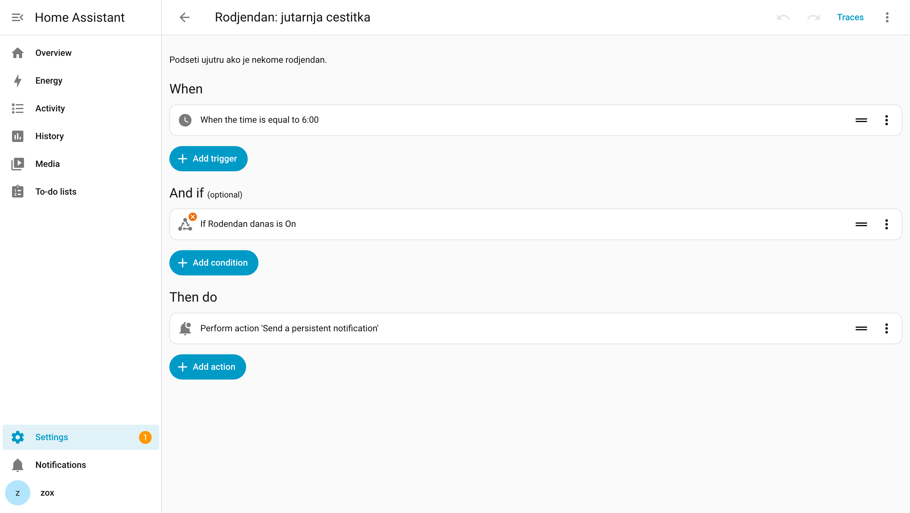

Skoro svako svoju prvu automatizaciju napravi isto: svetlo se pali na pokret. Radi savršeno tri dana, a onda ti se ugasi usred kupatila, ukućani kažu „šta si to opet uradio", i ti je isključiš.

Problem nije bio u pokretu. Problem je što je to automatizacija koja **rešava nepostojeći problem** — prekidač je bio na zidu, na dohvat ruke, i radio je. Automatizacije koje prežive prvi mesec imaju jednu zajedničku osobinu: rade nešto što ti ne bi mogao ručno, ili nešto što bi stalno zaboravljao.

Ovih pet su iz kuće koja radi svakodnevno, već godinama. Napisane su tako da ih možeš prekopirati, ali važnije od YAML-a su zamke ispod svake — svaka od njih je nekad nešto pokvarila.

Svaka automatizacija u Home Assistant-u ima ista tri dela, i vredi ih znati pre nego što nastaviš:



**When** je okidač — šta se desilo. **And if** su uslovi, koji su neobavezni i služe da automatizacija *ne* odradi kad ne treba. **Then do** je ono što se izvrši. Isto to u YAML-u su `trigger`, `condition` i `action`. Sve ispod je samo popunjavanje ta tri polja.

## 1. Prisustvo — temelj svega ostalog

Ovo nije automatizacija koju „vidiš". Ovo je ono na čemu sve ostalo stoji. Dok Home Assistant pouzdano ne zna da li je neko kod kuće, sve pametno što napraviš biće glupo u pogrešnom trenutku.

Najlakši način je aplikacija Home Assistant na telefonu, koja javlja lokaciju. Podesi zonu „Kuća" na oko 100 metara i dobio si `person.marko` sa stanjem `home` ili `not_home`.

Sad ono što ti niko ne kaže unapred.

**Zamka prva: telefon se zaglavi na „kod kuće".** Naročito iPhone. Ode čovek na posao, a Home Assistant i dalje misli da je u kući — jer je iOS uspavao aplikaciju i ona jednostavno nije javila da je otišla. Sve što zavisi od prisustva tiho radi pogrešnu stvar.

Rešenje nije da se boriš sa telefonom, nego da **dodaš drugi izvor istine: ruter**. Ruter zna da li je telefon na WiFi-ju, i on ne laže. Kad se ta dva ne slažu, ruter je jači:

```yaml
# configuration.yaml
binary_sensor:
  - platform: template
    sensors:
      marko_kod_kuce:
        friendly_name: "Marko kod kuće"
        # Ruter je jači: ako on kaže da telefona nema na mreži, čovek nije kod
        # kuće — bez obzira na to šta tvrdi aplikacija.
        value_template: >
          {{ is_state('device_tracker.marko_telefon_wifi', 'home')
             or (is_state('person.marko', 'home')
                 and not is_state('device_tracker.marko_telefon_wifi', 'not_home')) }}
```

**Zamka druga: baterija.** Kad uključiš precizniju lokaciju da bi prisustvo radilo brže, telefon počne da se prazni do večeri. Rešenje je da precizno praćenje radi **samo blizu kuće**, gde ti i treba, a da daleko od kuće telefon miruje:

```yaml
automation:
  - alias: "Telefon: precizan GPS samo blizu kuće"
    trigger:
      - platform: zone
        entity_id: person.marko
        zone: zone.blizu_kuce   # veća zona, ~2 km oko kuće
        event: enter
        id: ulazi
      - platform: zone
        entity_id: person.marko
        zone: zone.blizu_kuce
        event: leave
        id: izlazi
    action:
      - service: notify.mobile_app_telefon
        data:
          message: command_high_accuracy_mode
          data:
            command: >
              {{ 'turn_on' if trigger.id == 'ulazi' else 'turn_off' }}
```

Iskreno: kod nas se najveća ušteda baterije nije desila od ovoga, nego od toga što je interval slanja lokacije podignut sa 30 na 120 sekundi. Dve minute su sasvim dovoljne da kuća zna da dolaziš.

## 2. Bojler — jedina koja ti se vrati u novcu

Sve ostalo na ovoj listi je udobnost. Ovo je jedina automatizacija koja se plaća sama, i to prilično brzo.

Bojler je najveći pojedinačni potrošač u većini stanova, a greje vodu po rasporedu koji nema veze sa životom — kad niko nije kod kuće, i kad je struja skupa.

Ideja je jednostavna: **grej u jeftinoj tarifi, i to samo onoliko koliko ima ljudi u kući.** Troje kod kuće traži toplu vodu za tri tuširanja; jedan čovek ne traži.

```yaml
automation:
  - alias: "Bojler: grej po tarifi i prisustvu"
    trigger:
      - platform: time
        at: "23:30:00"          # početak jeftine tarife
    condition:
      - condition: numeric_state
        entity_id: sensor.broj_prisutnih
        above: 0                 # niko kod kuće = ne greje se uopšte
    action:
      - service: water_heater.set_temperature
        target:
          entity_id: water_heater.bojler
        data:
          # 1 osoba → 40°C, 2 → 50°C, 3 i više → 60°C
          temperature: >
            
            {{ 40 if n <= 1 else (50 if n == 2 else 60) }}
```

**Ako nemaš pametan bojler**, a većina nema, radi isto sa običnim relejem — Shelly ili Sonoff iza bojlera. Tada nema podešavanja temperature, nego se bojler prosto pali i gasi, pa umesto `water_heater.set_temperature` ide:

```yaml
    action:
      - service: switch.turn_on
        target:
          entity_id: switch.bojler
```

U vizuelnom editoru to izgleda ovako — okidač, uslov i akcija, tačno kao u YAML-u iznad:



Broj prisutnih je običan template senzor koji sabira ukućane:

```yaml
template:
  - sensor:
      - name: "Broj prisutnih"
        state: >
          {{ [ 'person.marko', 'person.marija', 'person.lea' ]
             | select('is_state', 'home') | list | count }}
```

**Zamka: automatika koja se ne vraća na svoje.** Neko će jednom ručno pojačati bojler na 70°C jer stižu gosti — i tako će ostati mesecima, a ti ćeš se čuditi računu. Dodaj automatizaciju koja svake noći vraća ručno podešavanje na automatsko:

```yaml
  - alias: "Bojler: noćni reset ručnog režima"
    trigger:
      - platform: time
        at: "00:01:00"
    action:
      - service: switch.turn_on
        target:
          entity_id: switch.bojler_auto
```

Ovo pravilo vredi i šire: **svaka automatizacija koju čovek može ručno da pregazi mora da ima trenutak kad se sama vraća na svoje.** Inače ćeš za mesec dana imati kuću punu zaboravljenih ručnih podešavanja.

## 3. Zvono → slika na telefon

Ovo je automatizacija koja najbrže ubedi ukućane da cela stvar ima smisla.

Neko pozvoni. Na televizoru iskoči sličica, na kiosk-ekranu u predsoblju se pojavi slika sa kamere, a onoga ko nije kod kuće stigne fotografija na telefon.

```yaml
automation:
  - alias: "Zvono: slika sa kamere na telefon"
    trigger:
      - platform: state
        entity_id: binary_sensor.zvono
        to: "on"
    action:
      - service: notify.mobile_app_telefon
        data:
          title: "Neko je na vratima"
          message: "Zvono u {{ now().strftime('%H:%M') }}"
          data:
            image: /api/camera_proxy/camera.ulazna_vrata
```



**Zamka: kuća koja te bombarduje.** Ako okidač vežeš i za detekciju pokreta na vratima, dobićeš obaveštenje svaki put kad komšija prođe hodnikom. Posle drugog dana isključićeš ga. Zato **cooldown**:

```yaml
    condition:
      - condition: template
        # ćuti tri minuta posle prethodnog javljanja.
        # `this` je sama ova automatizacija — ne moraš da pogađaš njen entity_id.
        value_template: >
          {{ (as_timestamp(now())
              - as_timestamp(this.attributes.last_triggered, 0)) > 180 }}
```

Automatizacija koja te previše zove je gora od one koje nema. Nju ćeš ugasiti — a sa njom i poverenje u sve ostalo.

## 4. „Odmor mod" — prekidač koji gasi sve

Ovo je najmanje efektna i najkorisnija stavka na listi.

Kad odeš na put, pola tvojih automatizacija odjednom nema smisla: bojler greje praznu kuću, svetla se pale na senzore, kuća živi svoj život bez tebe. A kad se vratiš u tri ujutru sa aerodroma, nijedna „jutarnja rutina" ne treba da se upali.

Napravi jedan `input_boolean` i provuci ga kao uslov kroz sve što ne sme da radi dok te nema:

```yaml
input_boolean:
  odmor_mod:
    name: "Odmor mod"
    icon: mdi:airplane
```

```yaml
automation:
  - alias: "Odmor mod: gasi svakodnevne automatike"
    trigger:
      - platform: state
        entity_id: input_boolean.odmor_mod
    action:
      - service: >
          automation.{{ 'turn_off' if is_state('input_boolean.odmor_mod', 'on') else 'turn_on' }}
        target:
          entity_id:
            - automation.bojler_grej_po_tarifi
            - automation.jutarnja_rutina
            - automation.dobrodoslica
```

Ista ta zastavica onda može da **uključi** ono što treba samo dok te nema — na primer da pokret u dnevnoj sobi pošalje snimak na telefon. Jedan prekidač, kuća u dva različita režima.

## 5. Kuća koja pamti umesto tebe

Poslednja je najsitnija i, iznenađujuće, ona koja najviše obraduje ljude.

Home Assistant zna datume rođendana ukućana i ujutru te podseti — pre nego što otvoriš telefon i vidiš da su te svi pretekli.

```yaml
input_datetime:
  rodjendan_marija:
    name: "Marija"
    has_date: true
    has_time: false
```

```yaml
template:
  - binary_sensor:
      - name: "Rođendan danas"
        state: >
          
          {{ d is not none
             and (d | timestamp_custom('%m-%d')) == now().strftime('%m-%d') }}

automation:
  - alias: "Rođendan: jutarnja čestitka"
    trigger:
      - platform: time
        at: "06:00:00"
    condition:
      - condition: state
        entity_id: binary_sensor.rodjendan_danas
        state: "on"
    action:
      - service: notify.mobile_app_telefon
        data:
          message: "Danas je Marijin rođendan 🎂"
```



Isti obrazac radi za sve što se ponavlja a lako se zaboravi: zamena filtera, registracija kola, plaćanje osiguranja, dan za iznošenje smeća. **Ovo je automatizacija u svom najčistijem obliku — ne radi ništa fizički, samo pamti umesto tebe.**

## Šta ovih pet imaju zajedničko

Nijedna ne pali svetlo.

- **Prisustvo** rešava nešto što ručno ne možeš — telefon u džepu ne možeš da pitaš gde si.
- **Bojler** rešava nešto što nikad ne bi radio dosledno — niko neće svake večeri računati koliko ljudi spava kod kuće.
- **Zvono** donosi informaciju tamo gde jesi, umesto da ti moraš do vrata.
- **Odmor mod** je priznanje da automatika ponekad treba da ućuti.
- **Rođendani** pamte umesto tebe.

Ako praviš prvu automatizaciju, pitanje nije „šta sve mogu da upalim". Pitanje je **šta stalno zaboravljam, ili šta radim svaki dan a ne bih morao**. Od tog odgovora kreni.

---

Ako još nemaš instaliran Home Assistant, kreni odavde: [instalacija za 30 minuta](/blog/instalacija-home-assistant-30-minuta/). Ako biraš hardver, pomoći će ti [Zigbee vs Z-Wave vs WiFi](/blog/zigbee-zwave-wifi-koji-hardver/).
